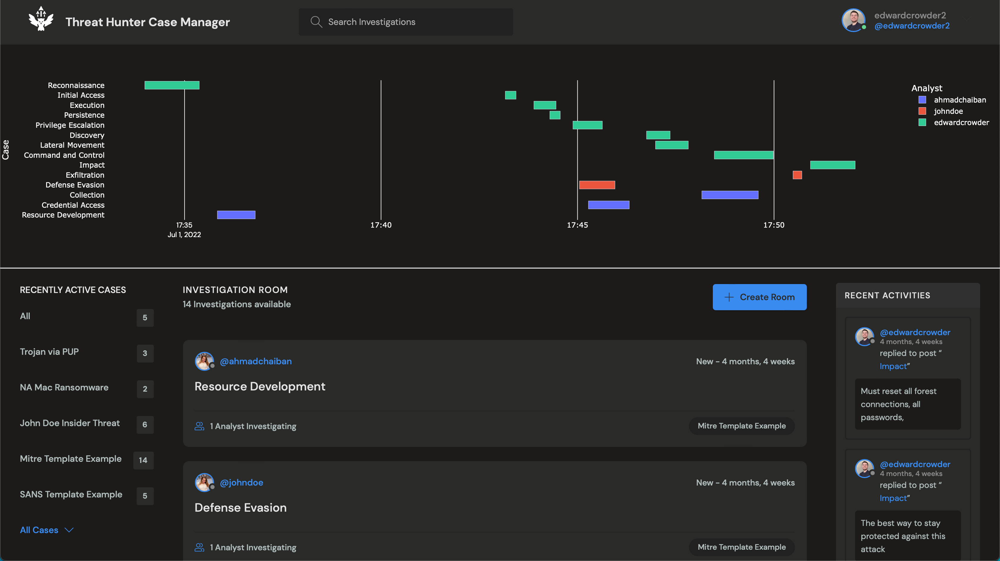
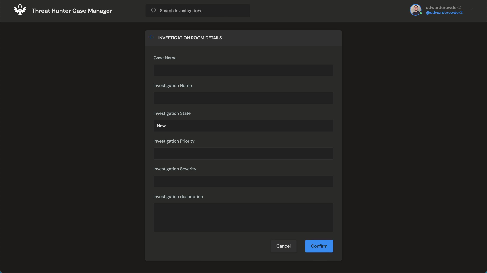
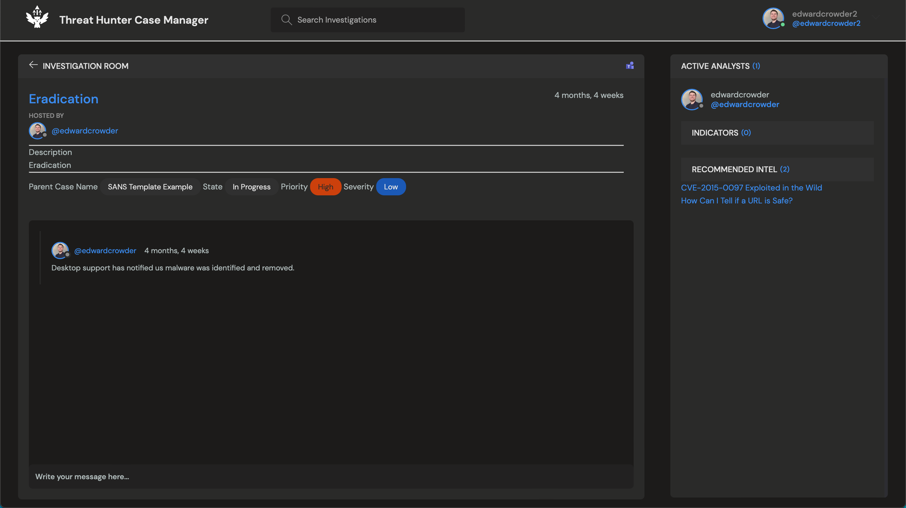
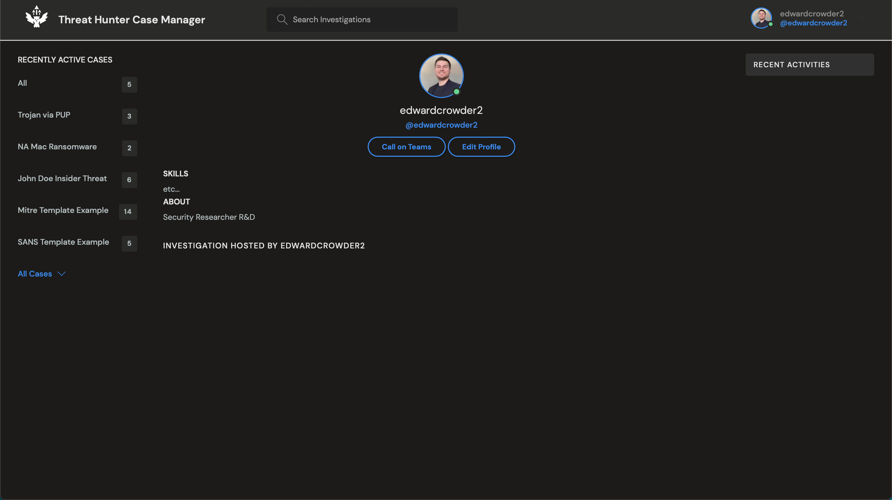

# CaseManager
Threat Hunter - Case Manager is a proof of concept cyber security incident tracker with a timeline emphasizing capturing the time used by analysts from start to finish. Ideal for threat hunting or cases which require multiple analysts working in parallel on different aspects of the case.

The goal of this project was: 
- Visualize the complete incident timeline per user to demonstrate how different parts of investigations can take additional times
- Provide analysts with a workspace for shared notes under one umbrella so that management does not need to ask for timelines or updates
- Provide a workflow-agnostic, and dynamic tracking platform so teams can work how they want


# Install
> This was a learning project for myself and is not suitable for production environments. Some components are unfinished and best practices were not followed in all aspects. The purpose of this project was purely to explore the django framework and I did not take security and scale into consideration. 

```
git clone https://github.com/crowdere/CaseManager.git
cd CaseManager/casemanager
source env/bin/activate
pip instal -r requirements.txt
python manage.py runserver
```
> use at your own risk.

## Application Images
### Landing Page

Landing page is broken down into 5 key components. 
1. Navigation Bar provides a Global search across all cases
2. Timeline view provides an indepth view of time taken from inital opening of an investigation room to the last updated time. Effectivley building out a dynmaic timeline based on how analysts work on and off again.
3. Active Case quick search (these are the parent items to Investigation Rooms)
4. Investigation Rooms can be created by any analyst and named anything they want to represent the work they are doing. In the below example you can see a MITRE ATT&CK template, however, this could be any fields which will autoamtically be timelined. 
5. Recent Activies list for Management/CISO to instantly see a twitter like feed of the last updated activies


### Create Investigation

A basic form to create an investigation room. This can be updated within the room.

### Investigation page

The investigation room itself is composed of 3 main components.
1. The case details, including case its assigned to, investigation name, current ticket status, current priority, current severity, and brief inital description. 
2. The analyst comments
3. The Intelligence panel:
- Lists all actives users who worked on this specific room 
- Automatically extracts indicators of compromise (IoCs) as defined in HERE
- (Todo) An intelligence engine which reviews current chat room converations to be analyzed and suggest more relevant news topics.


### Analyst page


Analyst page was designed to integrate with something like AD later on and automatically generate microsoft team links for that speciric analyst based on their registration email. 


### Other Credits
Inital base project adapted from https://www.youtube.com/watch?v=PtQiiknWUcI&t=23904s
